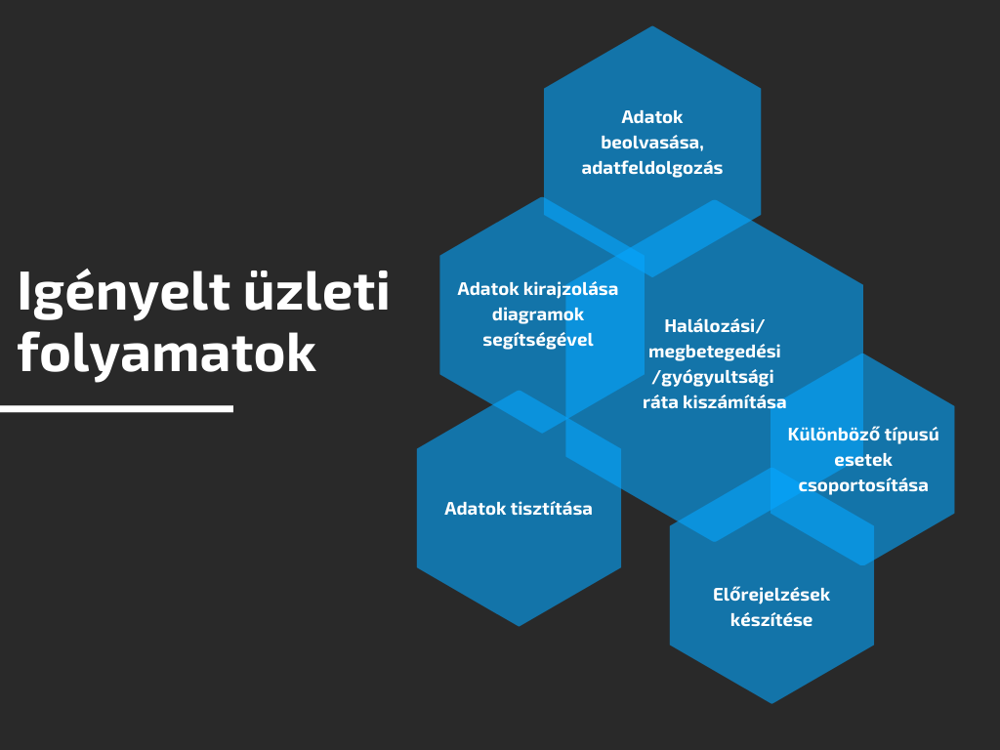
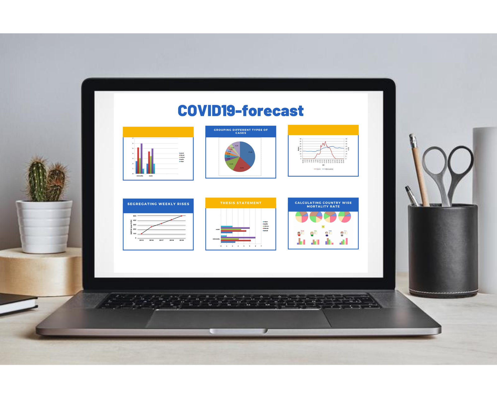

# Koronavírus statisztikai előrejelző rendszer funkcionális specifikáció

***1. Áttekintés*** 
A projekt célja felmérni a koronavírus helyzetet, és a statisztikák alapján előrejelzéseket készíteni. A statisztikai adatokat a WHO felmérései szolgáltatják. Az előrejelzéseket egy megfelelő algoritmus kell, hogy biztosítja a meglévő adatokból. Ezen kívül szükséges az adatokat megjeleníteni gráfok, oszlopdiagrammok, kördiagrammok formájában. Az előrejelzés az összes országra és külön Indiára is elkészül. Az adatok megjelenítését diagramok és táblázatok segítik.

Szükséges adatok: 
- Megfigyelés dátuma
- Állam
- Ország/ Régió
- Utolsó frissítés
- Megbetegedt lakosok száma
- Halálesetek száma
- Gyógyultak száma

 A fejlesztés a Google Colab segítségével fog zajlani, amely szolgáltatja a megfelelő Python modulokat, futtató környezetet és a könnyű megosztást. A kód Pythonban íródik és a legismertebb modulokat használja (pl. matplotlib, numpy).

***2. Jelenlegi helyzet*** 
 A **HealthLab Kft.** Magyarországon az egyik legnagyobb teszteléssel és adatfeldolgozással foglalkozó cég, amely szeretne felmérést készíteni a koronavírus járvány adataiból és előrejelzéseket készíteni. A járvány kiszámíthatatlansága rettegésben tartja az embereket, nehezíti az előre tervezést, hiszen a korlátozó intézkedések miatt lecsökken a mozgásterünk, alkalmazkodnunk kell a pandémiához. Az eddig feljegyzett adatok alapján, gépi tanuló algoritmusok segítségével elemezni tudjuk, hogy a fertőzésveszély, a járvány helyel-közel mikorra érheti el a tetőzést, milyen gyorsan terjedhet. Ezen információkat a feljegyzett megbetegedésekből, kigyógyulásokból illetve halálesetekből tudja kikövetkeztetni a rendszer. Ezen elemzések elvégzésével a cég hozzájárul a pandémiás időszak könnyebb átvészeléséhez.

***3. Követelménylista*** 
A statisztikai programban megjelenő funkciók táblázatba foglalása és al-funkciók leírása.

|   Modul   | ID |         Név         | Kifejtés |
|-----------|----|---------------------|----------|
|Elemző rendszer         | K1 | Adatok | Csak ellenőrzött, hivatalos adatokbázisokból nyert adatokkal dolgozhat a rendszer. |
|Elemző rendszer         | K2 | Adatok | Az adathalmazt meg kell tisztítani |
|Elemző rendszer         | K3 | Adatfeldolgozás | Az adatbázisból szükséges adatok: Világ országai, adott ország lakosainak létszáma,  országonkénti megbetegedések száma heti rendszerességgel, országonkénti gyógyultak száma heti rendszerességgel, országonkénti tesztelések száma heti rendszerességgel, országonkénti pozitív tesztesetek száma, megbetegedő lakosok átlag életkora. |
|Elemző rendszer         | K4 | Előrejelzés | Az adatokból előrejelzést egy adott országra vonatkozóan kell készíteni hogy ne igényeljen hosszú időt az adatfeldolgozás |
|Elemző rendszer         | K5 | Előrejelzés | Indiára külön előrejelzést és statisztikát kell készíteni|
|Felület       | K6 | Statisztika | Adatok megjelnítése eszlopdiagramok, táblázatok és vonaldiagramok segítségével |
|Felület       | K7 | ... |...|

***4. Jelenlegi üzleti folyamatok modellje*** 
Jelenleg a papíralapú számításokkal és kézzel történő digaramrajzolásokkal kevésbé hatékony és szemléletes az adatok kezelése és megjelenítése. A cég szeretne olyan adatfeldolgozást végezni, és az adatokat oly módon megjeleníteni, amiből egyértelműen látszik, hogy a koronavírus járványnak milyen pusztító hatásai vannak világszerte. Mélytanuló algoritmusok alkalmazásával pedig a jövőre vonatkozólag is adna egy lehetséges képet arról, hogy a járványnak milyen további hatásai lehetnek az emberiségre. Ennek érdekében az alábbiak kerülnének leváltásra, illetve kibővítésre:
- **5.1.** Koronavírus halálozási adatok hivatalos adatbázisból  =>  lekérés => elemzés 
- **5.2.** Adatok megtisztítása => eddig manuálisan kellett kiszűrni a hibás adatokat
- **5.3.** Lekért adatok feljegyzése =>  jelenleg az adatokból diagramok ábrázolása kézzel történik
- **5.4.** Több országból történő adatletöltés => Jelenleg lokálisan érkező adatok esetén nem lehet használható eredményt elérni, mivel dinamikusan történik a változás világviszonylatban
- **5.5.** Sok dimenziós adattábla használata csak a szükséges oszlopok felhasználásával (gyógyultak, betegek, halálozások, stb.) => jelenleg minden oszlop adatai kezelésre kerülnek, így az adatvizualizáció túl bonyolult, dimenziócsökkentés javasolt
- **5.6.** Statisztikai számítások (összegzés, eloszlás, maximum számítás, stb.) elvégzése beépített függvények segítségével => jelenleg papír alapú számítások
- **5.7.** Meglévő, feljegyzett adatokból egy tanuló modell felépítése, ami képes a jövőre vonatkozólag hiteles becslések számítására, azaz prediktálások elvégzésére => jelenleg csak a meglévő adatok állnak rendelkezésre, előrejelzés készítése bonyolult és körülményes 
   
***5. Igényelt üzleti folyamatok modellje*** 
- **6.1.** Egy olyan felület amely beolvassa az adatbázis adatait => adatfeldolgozás => elemzés => adatok kirajzolása programmal (diagramok)
- **6.2.** Elemzett adatok tovább vizsgálata => előrejelzés készítése egy adott országra vonatkozóan
- **6.3.** Adatok tisztitása
- **6.4.** Különböző típusú esetek csoportosítása
- **6.5.** Halálozási/megbetegedési/gyógyultsági ráta kiszámítása
- **6.6.** Előrejelzések készítése

  

***6. Használati esetek*** 
- A felhasználó látja a beolvasott adatokat és forrásukat.
- Látja az adatokból készült statisztikákat megjelenítve oszlopdiagramok és vonaldiagramok segítségével.
- Le tudja olvasni a táblázatból a predikciókat.

***7. Képernyő tervezete*** 

A statisztika egyszerűsített tervezete: 

 
 ***8. Forgatókönyv***  
 **Szereplők:**  
Futási időben két szereplő figyelhető meg. Az
első szereplő maga a futó ALKALMAZÁS. (weben/androidon)
Ezzel van interakcióban a második szereplő, maga a FELHASZNÁLÓ, aki ...

***9. Fogalomszótár*** 
**Mesterséges intelligencia** - lehetővé teszi a technika számára, hogy érzékelje környezetét, foglalkozzon azzal, amit észlel, problémákat oldjon meg, és konkrét cél elérése érdekében tervezze meg lépéseit. A számítógép nemcsak adatokat fogad (már előkészített vagy összegyűjtött adatokat érzékelőin, például kameráján keresztül), hanem fel is dolgozza azokat és reagál rájuk.

**Gépi tanulás** - a mesterséges intelligencia olyan ága, olyan rendszerekkel foglalkoznak, melyek tanulni képesek, azaz tapasztalatokból tudást generálnak. A gyakorlatban ez azt jelenti, hogy a rendszer példa adatok, minták alapján képes önállóan, vagy emberi segítséggel szabályszerűségeket/szabályokat felismerni/meghatározni.

**Mély tanulás** - a gépi tanulási technikák egy alcsoportja, amiben mesterséges neurális hálózatokat (Neural Networks) használunk.

**Adat** - tények, fogalmak olyan megjelenési formája, amely alkalmas emberi eszközökkel történő értelmezésre, feldolgozásra, továbbításra. 

**Adathalmaz** - információk összessége, sokasága. 

**Adatelemzés** - meglévő adatok feldolgozása, értelmezése, összekapcsolása.

**Predikcíó** - a már megismert és bizonyított törvényszerűségekből levonható következtetéseken alapuló előrejelzés, jóslat.

**Inicializáció** - kezdőértékek meghatározása.
