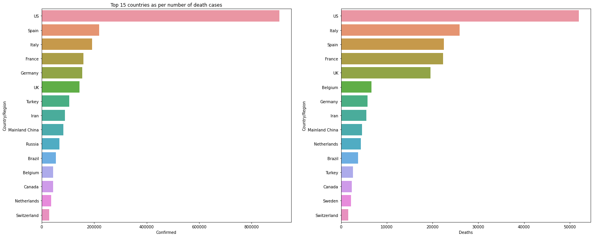

# Koronavírus statisztikai előrejelző rendszer követelményspecifikáció

***1. Áttekintés*** 
A projekt célja felmérni a koronavírus helyzetet, és a statisztikák alapján előrejelzéseket készíteni. A statisztikai adatokat a WHO felmérései szolgáltatják. Az előrejelzéseket egy megfelelő algoritmus kell, hogy biztosítja a meglévő adatokból. Ezen kívül szükséges az adatokat megjeleníteni gráfok, oszlopdiagrammok, kördiagrammok formájában. 
Szükséges adatok: 
- Megfigyelés dátuma
- Állam
- Ország/ Régió
- Utolsó frissítés
- Megbetegedt lakosok száma
- Halálesetek száma
- Gyógyultak száma

***2. Jelenlegi helyzet*** 
- A **HealthLab Kft.** Magyarországon az egyik legnagyobb teszteléssel és adatfeldolgozással foglalkozó cég, amely szeretne felmérést készíteni a koronavírus járvány adataiból és előrejelzéseket készíteni.

***3. Vágyálom rendszer*** 
- Az előrejelzéseket egy adott országra le lehessen kérdezni.
- Ezen felül oszlopdiagramos, kördiagramos, vonaldiagramos megjelenítés preferált.
- Különböző típusú esetek csoportosítása.
- Elvárás hogy a megjelenő adatok egy laikus számára is jól átteknithetőek és érthetőek legyenek.

***4. A rendszerre vonatkozó szabályok*** 
- Megbízható, hiteles adatbázisból származó adatokból kell az elemzést elkészíteni. (pl. WHO)
- Az eredmények reprodukálhatóak és könnyedén bővíthetőek legyenek.
- Legyen százalékos megjelenítés is.
- Ha weboldalon lesz a statistikai kimutatás, akkor a weboldal az összes elterjedt webböngészőn (Firefox, Chrome, Edge, Opera) igényesen nézzen ki és működjön megfelelően. A weboldal legyen modern, de egyszerű hogy a hozzá nem értők is értelmezni tudják a végkimenetelt.
- Elavult (deprecated) technológiákat kérjük ne használjanak, az időtállóság miatt
- A képek nagy felbontásúak legyenek, vízjel nélkül és png vagy jpg formátumúak
- A projektet ajánljuk valamilyen verziókezelő rendszer segítségével elkészíteni, a visszakövethetőség és az egyszerűbb csoportmunka miatt

***5. Jelenlegi üzleti folyamatok*** 
- 5.1. Koronavírus halálozási adatok hivatalos adatbázisból  =>  lekérés => elemzés 
- 5.2. Lekért adatok feljegyzése =>  jelenleg az adatokból diagramok ábrázolása kézzel történik

***6. Igényelt üzleti folyamatok*** 
- 6.1. Egy olyan felület amely beolvassa az adatbázis adatait => adatfeldolgozás => elemzés => adatok kirajzolása programmal (diagramok)
- 6.2. Elemzett adatok tovább vizsgálata => előrejelzés készítése egy adott országra vonatkozóan

***7. Riportok*** 
Kérdőív irányított riporthoz:

- Mit gondol, mit jelent Ön szerint az előrejelzés?
- Milyen előnyöket nyújtanak Önnek az előrejelzések?
- Milyen biztonsági szintet kell kielégítenie Ön szerint az adatok forrását tekintve?
- Milyen fő funkciókat vár el egy ilyen rendszertől?
- Milyen „vágyálom” funkciókat látna szívesen egy ilyen rendszertől?
- Kérem, írja körül, hogy jelenleg hogyan megy Önöknél egy adatfeldolgozás és elemzés? Milyen nehézségek adódtak ezeken?
- Kérem, soroljon előnyöket / hátrányokat a jelenlegi adatfeldolgozás  és a "vágyálom" adatfeldolgozás relációjában!
- Mit gondol, egy weboldal lehet alapja egy adafeldolgozó és megjelenítő, valamint előrejelző rendszernek?
- Milyen ablakok legyenek a rendszerben? Kérem, adjon képernyő terveket!
- Hallott már hasonló szolgáltatásról? Esetleg használja valamelyiket? Milyen tapasztalatai vannak?
- Ön szerint szükség van egy ilyen rendszere?
- Milyen költségei vannak a jelenlegi adatfeldolgozással kapcsolatban? Ön szerint csökkennének vagy nőnének ezek
a költségek egy adatfeldolgozó és előrejelző rendszer esetén?

***8. Követelménylista*** 
A statisztikai programban megjelenő funkciók táblázatba foglalása és al-funkciók leírása.

|   Modul   | ID |         Név         | Kifejtés |
|-----------|----|---------------------|----------|
|Elemző rendszer         | K1 | Adatok | Csak ellenőrzött, hivatalos adatokbázisokból nyert adatokkal dolgozhat a rendszer. |
|Elemző rendszer         | K2 | Adatfeldolgozás | Az adatbázisból szükséges adatok: Világ országai, adott ország lakosainak létszáma,  országonkénti megbetegedések száma heti rendszerességgel, országonkénti gyógyultak száma heti rendszerességgel, országonkénti tesztelések száma heti rendszerességgel, országonkénti pozitív tesztesetek száma, megbetegedő lakosok átlag életkora. |
|Elemző rendszer         | K3 | Előrejelzés | Az adatokból előrejelzést egy adott országra vonatkozóan kell készíteni hogy ne igényeljen hosszú időt az adatfeldolgozás |
|Elemző rendszer         | K4 |  ... |...|
|Jogi szabályok| K5 |Jogi nyilatkozatok   |Adatvédelmi nyilatkozat, GDPR, ASZF, szükség esetén Cookie szabályzat feltüntetése a weblapon. (?) |
|Felület       | K6 | ... |...|
|Felület       | K7 |...  |...|
|Felület       | K8 |...   |...|
|Felület       | K9 |...|...|
|Felület       | K10 |... |...|

***9. Fogalomszótár*** 
**Mesterséges intelligencia** - lehetővé teszi a technika számára, hogy érzékelje környezetét, foglalkozzon azzal, amit észlel, problémákat oldjon meg, és konkrét cél elérése érdekében tervezze meg lépéseit. A számítógép nemcsak adatokat fogad (már előkészített vagy összegyűjtött adatokat érzékelőin, például kameráján keresztül), hanem fel is dolgozza azokat és reagál rájuk.

**Gépi tanulás** - a mesterséges intelligencia olyan ága, olyan rendszerekkel foglalkoznak, melyek tanulni képesek, azaz tapasztalatokból tudást generálnak. A gyakorlatban ez azt jelenti, hogy a rendszer példa adatok, minták alapján képes önállóan, vagy emberi segítséggel szabályszerűségeket/szabályokat felismerni/meghatározni.

**Mély tanulás** - a gépi tanulási technikák egy alcsoportja, amiben mesterséges neurális hálózatokat (Neural Networks) használunk.

**Adat** - tények, fogalmak olyan megjelenési formája, amely alkalmas emberi eszközökkel történő értelmezésre, feldolgozásra, továbbításra. 

**Adathalmaz** - információk összessége, sokasága. 

**Adatelemzés** - meglévő adatok feldolgozása, értelmezése, összekapcsolása.

**Predikcíó** - a már megismert és bizonyított törvényszerűségekből levonható következtetéseken alapuló előrejelzés, jóslat.

**Inicializáció** - kezdőértékek meghatározása.