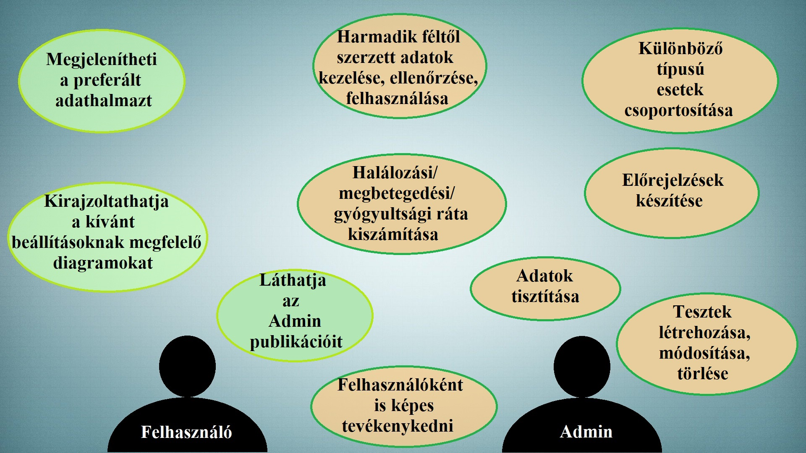
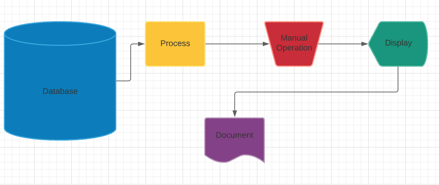
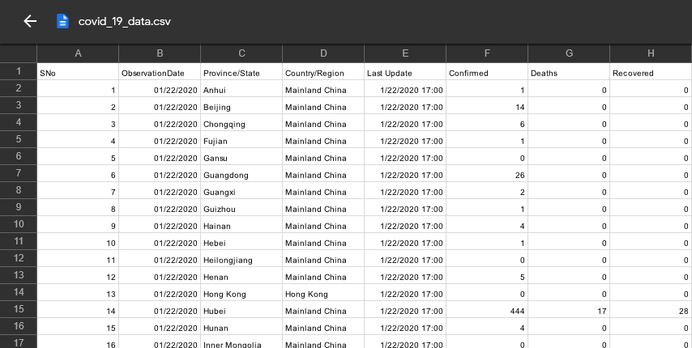

# Rendszerterv

***1. A rendszer célja*** 
A rendszer célja felmérni a koronavírus helyzetet, és a statisztikák alapján előrejelzéseket készíteni. A statisztikai adatokat a WHO felmérései szolgáltatják. Az előrejelzéseket egy megfelelő algoritmus kell, hogy biztosítja a meglévő adatokból. Gépi tanuló algoritmusok segítségével elemezni tudjuk, hogy a fertőzésveszély, a járvány hellyel-közzel mikorra érheti el a tetőzést, milyen gyorsan terjedhet. Ezen információkat a feljegyzett megbetegedésekből, kigyógyulásokból illetve halálesetekből tudja kikövetkeztetni a rendszer. Ezen kívül szükséges az adatokat megjeleníteni gráfok, oszlopdiagrammok, kördiagrammok formájában. Az előrejelzés az összes országra és külön Indiára is elkészül. 

Szükséges adatok: 
- Megfigyelés dátuma
- Állam
- Ország/ Régió
- Utolsó frissítés
- Megbetegedt lakosok száma
- Halálesetek száma
- Gyógyultak száma

A fejlesztés a Google Colab segítségével fog zajlani, amely szolgáltatja a megfelelő Python modulokat, futtató környezetet és a könnyű megosztást. A kód Pythonban íródik és a legismertebb modulokat használja (pl. matplotlib, numpy).
A rendszer a weben lesz elérhető, így bármilyen böngészővel rendelkező eszközön használató.

***2. Projektterv*** 
**Projekt munkatársak és felelőségek:**

Backend munkálatok: 
- Pete Balázs
- Szabó Bence
- Szimeonov Viktória
- Tóth Csenge Beatrix
- Tóth Zoltán

Feladatuk a funkciók létrehozása és megvalósítása.

| Funkció / Story | Feladat / Task | Prioritás | Becslés | Aktuális becslés | Eltelt idő | Hátralévő idő |
|-----------------|----------------|-----------|---------|------------------|------------|---------------|
| Követelmény specifikáció | | 0 | 12 | 12 | 12 | 0 |
| Funkcionális specifikáció | | 0 | 12 | 12 | 12 | 0 |
| Rendszerterv | | 0 | 16 | 16 | 16 | 0 |
| Fejlesztés (Global) | Google Colab | 1 | 2 | 2 | 2 | 0 |
| Fejlesztés (Global) | Adathalmaz keresése/választása | 1 | 6 | 6 | 0 | 0 |
| Fejlesztés (Global) | Szükséges könyvtárak/csomagok importálása | 1 | 6 | 6 | 0 | 0 |
| Fejlesztés (Global) | Adathalmaz importálása, annak tesztelése, tisztítása | 1 | 6 | 6 | 0 | 0 |
| Fejlesztés (Global) | Különböző típusú esetek csoportosítása (egy konkrét vagy több eset választása) | 1 | 6 | 6 | 0 | 0 |
| Fejlesztés (Global) | A heti emelkedések elkülönítése | 1 | 6 | 6 | 0 | 0 |
| Fejlesztés (Global) | Megbetegedett és halálesetek számának heti növekedése | 1 | 6 | 6 | 0 | 0 |
| Fejlesztés (Global) | Országonkénti halálozási ráta kiszámítása | 1 | 6 | 6 | 0 | 0 |
| Fejlesztés (Global) | Adatok elemzése egy vagy több konkrét ország esetén | 1 | 6 | 6 | 0 | 0 |
| Fejlesztés (Global) | Model létrehozása | 1 | 6 | 6 | 0 | 0 |
| Fejlesztés (Global) | Model létrehozása konvoluciós háló segítségével | 1 | 6 | 6 | 0 | 0 |
| Fejlesztés (Global) | Idősoros elemzés a pontos adatok megszerzéséhez | 1 | 6 | 6 | 0 | 0 |
| Fejlesztés (Global) | A modell inicializálása, amely előrejelzést és előrejelzést tartalmaz | 1 | 6 | 6 | 0 | 0 |
| Fejlesztés (Global) | Eredménymentés | 1 | 6 | 6 | 0 | 0 |
| Fejlesztés (India) | Vizualizációs, gépi tanulós könyvtárak importálása | 1 | 6 | 6 | 0 | 0 |
| Fejlesztés (India) | Koronavírus megfertőzések beolvasása | 1 | 6 | 6 | 0 | 0 |
| Fejlesztés (India) | Koronavírusos halálesetek beolvasása | 1 | 6 | 6 | 0 | 0 |
| Fejlesztés (India) | Koronavírusból felépülések beolvasása | 1 | 6 | 6 | 0 | 0 |
| Fejlesztés (India) | Dátumok átalakítása napokba | 1 | 6 | 6 | 0 | 0 |
| Fejlesztés (India) | Esetek plotolása dátummal | 1 | 6 | 6 | 0 | 0 |
| Fejlesztés (India) | Napi esetek kimutatása | 1 | 6 | 6 | 0 | 0 |
| Fejlesztés (India) | Átlag négyzetes hiba | 1 | 6 | 6 | 0 | 0 |
| Fejlesztés (India) | Átlag abszolút hiba | 1 | 6 | 6 | 0 | 0 |
| Tesztelés | | 1 | 16 | 16 | 10 | 6 |
| Értékelés | | ? | ? | ? | ? | ? |

***3. Üzleti folyamatok modellje*** 

***4. Követelmények*** 
Követelmények, funkciók, melyek a megfelelő működéshez elengedhetetlenek.
- Funkcionális követelmények:
  - Csak ellenőrzött, hivatalos adatokbázisokból nyert adatokkal dolgozhat a rendszer.
  - Az adatokból előrejelzést egy adott országra vonatkozóan kell készíteni hogy ne igényeljen hosszú időt az adatfeldolgozás
  - A statisztikákat diagramok és táblázatok segítségével meg kell jeleníteni.
  - Predikciót kell készíteni különböző tulajdonságokhoz.
- Nem funkcionális követelmények:
  - A rendszer minimális válaszidőn belül feldolgozza az adatokat.
  - Biztonságos működés.
  - Könnyű karbantarthatóság.
  - Működőképesség, használhatóság.
  - Adatok megbízhatósága és rendelkezésre állása.
  - Az adatok megtisztítása.
- Törvényi előírások, szabványok:
  - GDPR-nak, ÁSZF-nek való megfelelés.

***5. Funkcionális terv*** 
**<ins>Rendszer szereplők:<ins>**
- Admin
- Felhasználó

**<ins>Rendszerhasználati esetek és lefutásaik:<ins>** 
ADMIN:
- Beléphet bármilyen szereplőként teljes hozzáférése van a rendszerhez
- Tesztek létrehozása, törlése, módosítása

FELHASZNÁLÓ:
- Képes kirajzoltatni a preferált beállításoknak megfelelő diagrammokat.
- Képes megjeleníteni a preferált adathalmazt.

***6. Fizikai környezet*** 
  
- A rendszer Android és web platformon, hordozható eszközökön (okostelefonok, táblagépek) futtatható.
- Az összes elterjedt webböngészőn (Firefox, Chrome, Edge, Opera) megfelelően működik.
- Nincsenek megvásárolt komponenseink.
- Fejlesztői eszközök:
  - Google Colab

***7. Architektúrális terv*** 
  

***8. Adatbázis terv*** 
| Column Name / Oszlop neve| Description / Leírás | Data type / Adattípus | 
|--------------------------|----------------------|-----------------------|
|ObservationDate| Adott megfigyelés dátuma | object |
|Province/State| Adott állam megnevezése | object |
|Country/Region| Adott ország/ régió megnevezése| object |
|Last Update| Utolsó frissítés dátuma | object |
|Confirmed| Megbetegedt lakosok száma| float64|
|Deaths| Halálesetek száma|float64|
|Recovered| Gyógyultak száma|float64|

***9. Implementációs terv*** 
A rendszerünk főként Python nyelven fog készülni. Ezeket a programrészeket, amennyire csak lehet külön boxokba írva készítjük, és úgy fogjuk egymáshoz csatolni a jobb átláthatóság, könnyebb változtathatóság, és könnyebb bővítés érdekében. Képes lesz feldolgozni egy vagy több adathalmazt, és a benne tárolt adatok alapján előrejelzéseket készíteni a felületen.
A Python legelterjedtem moduljait használjuk. 
- Az adatok manipulálására, elemzésére és modellezésére, valamint a regresszióoz a pandas modult használjuk.
- A matplotlib a plotok (diagramok stb.) kirajzolásáért felel
- A seaborn a statisztikai elemzes és ezekből készülő grafikonok létrehozását teszi lehetővé
- Valamint a numpy a tömbök kezelésében segít

***10. Karbantartási terv*** 
A rendszer folyamatos karbantartására nincsen szükség. A kiadást követő felmerülő hibákat javítjuk. Ellenőrizni kell, hogy frissebb webböngészőkön is jól működik a program.

***11. Tesztterv*** 
  A szoftver tesztelésének kezdeti fázisában meg kell győződni a harmadik féltől szerzett adatok valósághűségéről. Mivel egy prognózist állítunk fel a programmal és nem már beigazolódott történéseket jelenítünk meg, ezért a nem megfelelő adatokkal való dolgozás jelentősen fals eredményt adhat a jövőbeli valós eseményekhez képest.
Ezen hibák elkerülésének érdekében hivatalos oldalról származó, globálisan elfogadott adatokkal dolgozunk. 

***12. Telepítési terv*** 
**Webes alkalmazás:**
    A szoftver webes felületéhez csak egy ajánlott böngésző telepítése szükséges (Google Chrome, Firefox, Opera, Safari) illetve egy Google fiókos regisztráció, külön szoftver nem kell hozzá. A weboldalra közvetlenül az internetről kapcsolódnak rá a kliensek.
    
**Mobil alkalmazás:**
    A szoftver hordozható eszközökön (okostelefonok, táblagépek) történő futtatásához a Google Colab Androidos webnézegető alkalmazásának letöltése javasolt, illetve egy érvényes Google fiók. Az alkalmazás lehetővé teszi a Google Colab használatát, reklám- és hirdetésmentesen.
